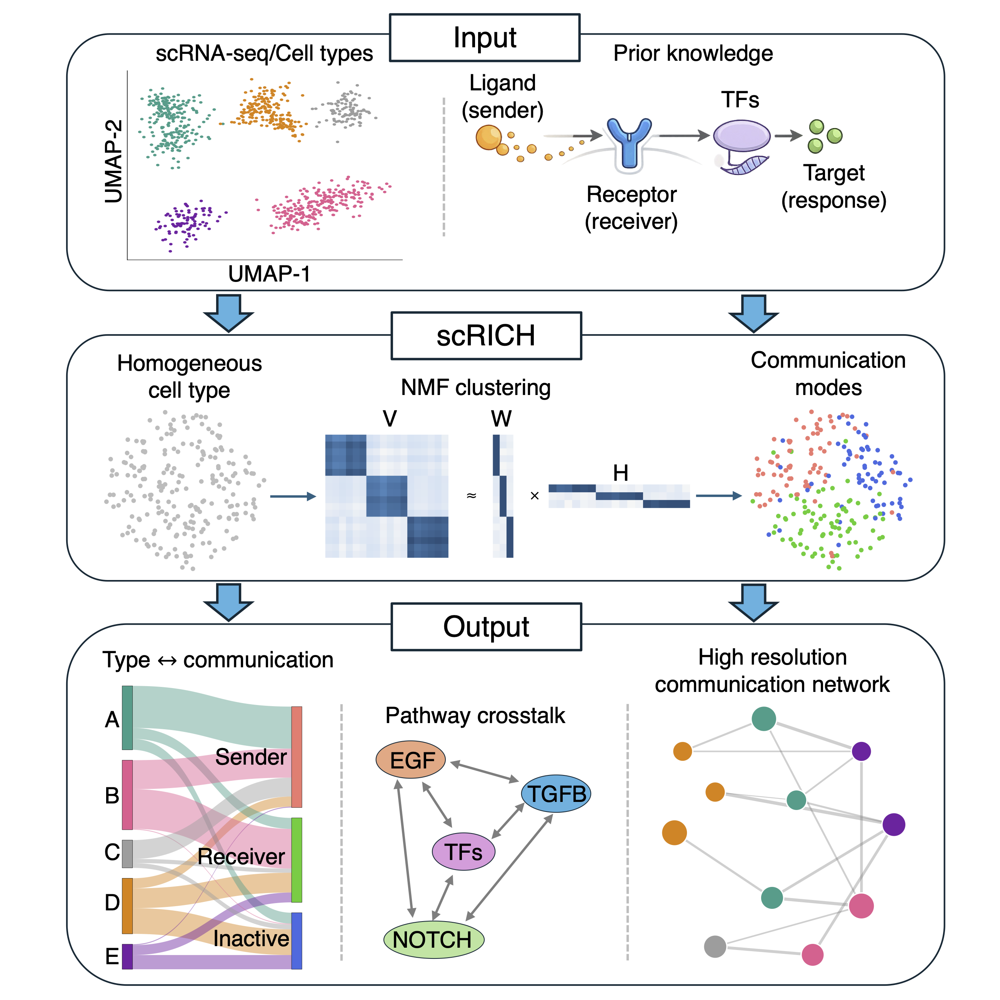

# Robust-Identification-of-Cell-cell-Communication-Heterogeneity-in-single-cells
This repository hosts the code of the scRICH method, which is now published in [Cell Systems](https://www.cell.com/cell-systems/fulltext/S2405-4712(26)00185-7). The method is developed by [Federico Bocci](https://www.ru.nl/en/departments/radboud-institute-for-molecular-life-sciences/computational-cell-fate) at Radboud University.

### How to run scRICH
Currently, the method can be run by downloading the code on your computer and creating a Python environment using the requirements.txt file. A package version of scRICH installable via pip and readthedocs documentation are coming soon!

### Documentation
Tutorial 1 provides the overview of the main functionalities of the model and details explanation of the commands. Tutorials 2-3-4 discuss specific edge-cases about modifying the ligand-receptor set of a specific CCC pathway (tutorial 2), integrating external CCC inference methods (tutorial 3), and comparing RNA velocity methods for CCC inference. These files can be found on Zenodo with project number [19859013](https://zenodo.org/records/19859014), and should be placed in the same folder of the scRICH code.

### Additional data
To run some of the commands in the tutorials, you will need additional data about ligand-receptor-TF interactions from [exFinder](https://academic.oup.com/nar/article/51/10/e58/7110758) (to run the CCC matrix inference using downstream targets of the pathway - unless the targets are provided by the user) as well as the datasets for tutorials 3 and 4. Otherwise, the code can be run on your own dataset without additional files needed.

### Contacts
For any question, get in touch with Federico Bocci.
